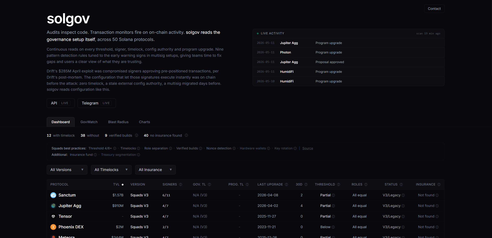
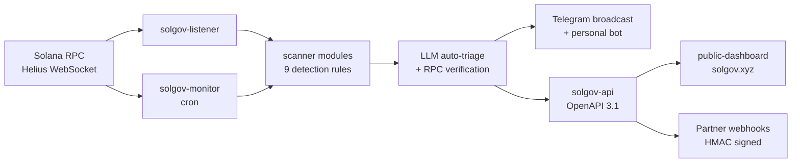
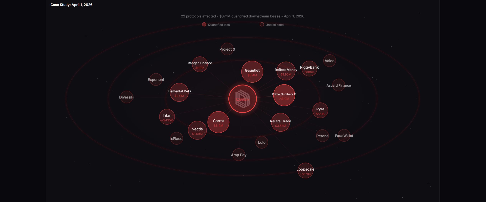
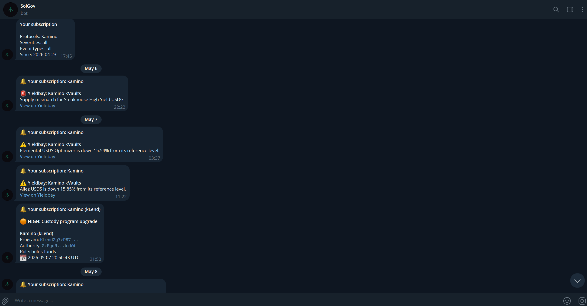
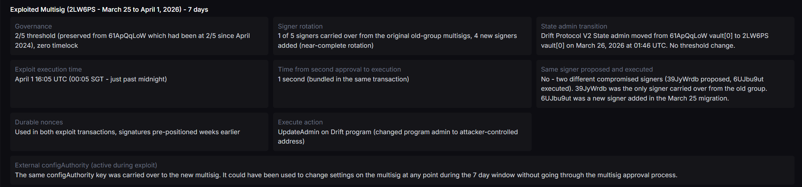
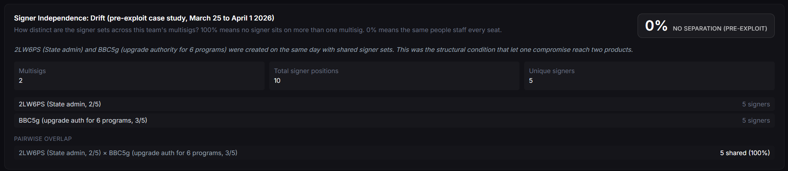

# solgov

[](LICENSE)
[](https://github.com/EdgeVault/solgov/commits/main)
[](https://solgov.xyz)
[](https://api.solgov.xyz/api/state)



solgov is the governance transparency layer for Solana DeFi. Continuous reads across 50+ protocols, surfacing the setup-risk patterns that precede admin-key exploits.

## Try it

- 3-minute demo: [youtu.be/F1clEqm7SRk](https://youtu.be/F1clEqm7SRk)
- Dashboard: [solgov.xyz](https://solgov.xyz)
- Public alerts: [t.me/SolGovActivity](https://t.me/SolGovActivity) (Telegram channel for real-time alerts on threshold, member, timelock, and configAuthority changes)
- Personal subscriptions: [@SolGov_bot](https://t.me/SolGov_bot) (filter by severity and event type, `/check` lookups)

## Verify

- Live API: [api.solgov.xyz/api/state](https://api.solgov.xyz/api/state) returns the current governance state for every tracked protocol. JSON, no auth.
- API docs (OpenAPI 3.1): [solgov.xyz/api-docs.html](https://solgov.xyz/api-docs.html)
- Source of truth for protocol entries: [`public-dashboard/src/data/protocols.ts`](public-dashboard/src/data/protocols.ts)

Every claim in the dashboard traces to an on-chain RPC read or a named source URL. Open the API endpoint in any browser to confirm.

## Latest

- May 2026: program coverage expanded to 188 programs across 50+ protocols
- May 2026: LLM auto-triage with on-chain follow-up RPC verification on critical events. The system reads additional account state before classifying an alert as real signal versus noise
- May 2026: risk-weighted alert frequency by program criticality (treasury, admin authority, TVL exposure)
- Apr 2026: public API shipped with OpenAPI 3.1 spec, versioned endpoints, bulk + search, and webhook subscriptions
- Apr 2026: centralised alert-guard with rate limits, severity tiering, and panic-mode kill switch
- Apr 2026: Yieldbay incidents integrated into the dashboard activity feed and Telegram subscriber fanout
- Apr 2026: signer-funder detection live with a cross-protocol funder registry

---

## What this repo contains

```
public-dashboard/   React + Vite, deployed to Vercel
sentinel/           Scanner, listener, monitor cron, API, Telegram bot (VPS)
```

### Architecture



### public-dashboard

The web UI at `solgov.xyz`. Four tabs:

- **Dashboard** - sortable table of every tracked protocol's governance state
- **GovWatch** - live activity feed and a governance health view for every team in the table
- **Blast Radius** - dependency map showing how a compromise in one protocol can cascade
- **Charts** - exploit history, risk metrics, governance health over time



Data flows: build-time snapshot bundled into the app, then `/api/state` and `/api/historical` overlay live state on first render.

### sentinel

The backend that runs on a VPS:

- `solgov-listener.ts` - WebSocket account-subscribe on every tracked Squads V4 multisig. Detects threshold, member, timelock, and configAuthority diffs in real time.
- `solgov-monitor.ts` - cron-driven full + config scans. Catches anything the listener misses (V3 multisigs, programs where no multisig was found on the upgrade authority, Wormhole, Realms DAO).
- `solgov-api.ts` - HTTP API. Serves monitor state, historical aggregates, and the governance slice for any tracked protocol. Receives Helius webhooks.
- `solgov-bot.ts` - Telegram bot. `/status`, `/check`, `/report`, `/nonce`, subscriptions with severity and event-type filters, auto-triage on critical alerts.



- `scanner/` - reusable detection modules (governance type, nonce signers, circuit breakers, signer profiles, verified builds, program authority lookup, rotation detection).
- `output/` - report generation (markdown summaries + structured data).
- `llm-*.ts` - Groq-backed triage for critical alerts. When a critical event fires, the triage layer makes follow-up RPC reads to verify the signal against current account state before surfacing the alert, cutting noise without burying real warnings.

#### Detection rules

The scanner library implements nine pattern detectors tuned to the early warning signs in multisig setups:

1. Brand-new signer placed on a fresh multisig at creation
2. Rehearsal-pattern fingerprint (small membership, all-signed proposal, never executed)
3. Controlled multisig clusters (same external configAuthority across multiple multisigs)
4. Weakest-link migration (admin role transferred to a multisig with weaker posture)
5. Fresh-multisig handover (admin role transferred to a multisig less than 14 days old)
6. Stale config authority (long-dormant external configAuthority keys)
7. Governance bursts (security-model config changes in rapid succession on a single multisig)
8. Upgrade authority concentration (single vault PDA holding upgrade authority over many programs)
9. Signer funder detection (signers funded by sources outside the existing registry)



---

## Depth, not just breadth

The rules above are the surface. Underneath, the system is built to handle the patterns single-source monitoring misses.

### Multi-version on-chain decoding
- Custom byte-layout parsing for Squads V4, Squads V3, Serum Multisig, the Marinade mean-multisig fork, and SPL Governance. Each program has different seed conventions and account ordering; the code maintains separate reverse-lookup paths rather than one generic decoder.
- Vault PDA reverse lookup runs three fallback strategies (instruction-level parse, top-level account keys with owner verification, createKey-based PDA derivation) so vault discovery rarely fails silently.
- BPF Upgradeable Loader authority lookup with byte-offset preconditions: program data length is validated before authority field reads, distinguishing "immutable" from "unparseable" cleanly.
- Wormhole guardian set decoding with the hardcoded `floor(N*2/3) + 1` VAA threshold and little-endian guardian-set-index seed encoding to match the on-chain layout.

### Multi-layer verification
- WebSocket listener detects threshold, member, timelock, and configAuthority diffs in seconds via account-subscribe with previous-state diffing so only genuine deltas surface.
- Cron-driven backfill covers V3 multisigs, Wormhole guardian sets, Realms DAOs, and any new on-chain governance change the listener missed.
- LLM auto-triage on critical alerts: a narrow toolset, capped iterations, and follow-up RPC reads before classification. Output is sanitised of LLM-emitted pseudo-function-call syntax before posting. Triage actions are admin-gated to bound cost.

### Detection beyond multisig configuration
- **Cross-program upgrade authority concentration**: `getProgramAccounts(BPFLoaderUpgradeab1e)` with memcmp filter to find every program controlled by a given vault PDA. Live finding: Helium vault 2 controls 24 programs; Drift's BBC5g held upgrade authority for 7 Drift programs at exploit time (now 6, after Drift Protocol V2 was moved to a recovery vault on April 2).
- **Signer independence**: ratio of unique signers to total signer slots across a team's multisigs. Jupiter has zero signer overlap across Perps, Lend, and Agg. Drift pre-exploit had five signers shared across 2LW6PS and BBC5g.


- **Cross-protocol signer-funder registry**: when a new-funder anomaly fires at protocol A, the funder is recorded. Repeat hits at protocol B upgrade severity to "cross-protocol repeat offender". A network-effect defence where one protocol's detection protects every other tracked protocol.
- **Brand-new signer detection**: flags multisig members whose wallet age is under 7 days at multisig creation. Drift's recovery multisig still has brand-new signers.
- **External configAuthority detection**: external keys flagged with dormancy duration tracked. Drift's `A1eC8n2t` was dormant 139 days as of the April 17, 2026 forensic scan (last signing activity November 29, 2025) and was the only V4 protocol in the tracked set with this configuration.

### Methodology
- TVL-weighted prioritisation: high-TVL protocols with unverifiable governance configuration receive heavier scrutiny than smaller protocols with the same configuration. Capital at stake informs where attention goes, not whether something is surfaced.
- **Drift-pattern condition match**: count of how many of the eight conditions present in Drift's pre-exploit configuration appear in a tracked protocol. Each condition is enumerated, not weighted.
- Zero timelock is the single condition with the largest exposure window. It is the control that would have prevented the Drift exploit.

### Token-layer and adjacent coverage
- 30 SPL tokens monitored for freeze/mint authority changes.
- Helium-style circuit breaker coverage on token mints.
- Token-2022 extension flags: transfer hooks, freeze authority, mint renunciation.
- 22 LayerZero DVN multisigs included for cross-chain bridge governance surface.
- 1-of-N SPL Token Multisig setups flagged (any single key acts unilaterally).
- Durable nonce detection across tracked signers, prioritised by signal strength: `initializeNonceAccount` on a tier-1 signer is treated as the highest-priority case (a "Drift-shape, new pre-staging pattern"); established nonces older than 30 days drop to the lowest priority to avoid false positives on legitimate operational use. Nonce age established via `getSignaturesForAddress`.

### Operational hardening
- HMAC-SHA256 webhook signing with timing-safe secret comparison (constant-time, resists timing-based secret enumeration).
- Per-subscriber webhook fanout with isolated timeouts so one unresponsive partner cannot block the listener.
- Exponential backoff with labeled retry logging (failures traceable, not silent).
- Cloudflare-aware Helius requests (browser User-Agent fix for the 1010 block on Node's default fetch).
- Severity-routed Telegram delivery to separate threads so teams can mute lower-priority output without losing the most urgent alerts.
- RPC quota awareness: result capping with graceful timeout, partial-data returns rather than full-scan failure.

### Risk-weighted alert frequency
Programs controlling treasuries, admin authorities, and large TVL receive higher-frequency monitoring than lower-stakes infrastructure. The listener routes events by signal strength: threshold decreases, removal of three or more members, timelock removal, and external configAuthority being set are the highest-priority cases; partial member rotation, timelock decreases, and configAuthority being cleared are surfaced separately so teams can mute lower-priority channels without losing the urgent ones.

### Percolator research surface
A separate observational research stream calibrates solgov's noise floor by watching probe activity against an immutable Solana program with admin keys burned and a public bounty vault. Transactions are decoded by instruction tag and classified as legitimate, probe, or unclear. The probe patterns feed back into the scanner's signal filters here. Methodology, classification buckets, and feedback loop are documented in [`docs/percolator-research.md`](docs/percolator-research.md). The research surface code itself is not part of this repo; the consuming detection logic is.

---

## Running it

### public-dashboard

```bash
cd public-dashboard
npm install
npm run dev
```

Build:
```bash
npm run build
```

Vercel deploy is direct - no GitHub integration.

### sentinel

```bash
cd sentinel
npm install
cp .env.example .env   # fill in HELIUS_API_KEY, HELIUS_RPC_URL, TELEGRAM_BOT_TOKEN, GROQ_API_KEY
```

Run a config scan:
```bash
npx tsx src/solgov-monitor.ts config
```

Run the listener:
```bash
npx tsx src/solgov-listener.ts
```

Run the API:
```bash
npx tsx src/solgov-api.ts
```

The Telegram bot, listener, monitor, and API all run as `pm2` daemons in production.

---

## Data sources

- **On-chain reads** via Helius RPC: every multisig threshold, signer, timelock, config authority, program upgrade, and proposal lifecycle
- **TVL** via DeFiLlama
- **Protocol health flags** via the Yieldbay API (cached at `sentinel/data/yieldbay-cache.json`)
- **Audit firms, public docs, and disclosure context** are hand-curated against source links in `public-dashboard/src/data/protocols.ts`

Nothing scraped. Anything not from on-chain reads is credited at the source.

---

## Status

- 50+ protocols tracked across 63 multisigs (Squads V4, V3, Serum, mean-multisig)
- 188 programs mapped, 22 LayerZero DVNs and 30 SPL tokens included in coverage
- Durable nonce detection, Token-2022 extension flags, and 1-of-N signer setups all surfaced
- Public good: open source under MIT, free dashboard, free API with no auth, no token
- Engagement: ecosystem leaders and protocol teams have reached out privately. See [`disclosures.md`](disclosures.md).

Built solo by [@Trader_CSK](https://x.com/Trader_CSK).

---

## Contributing

See [`CONTRIBUTING.md`](CONTRIBUTING.md) for how to suggest a protocol or report a factual correction. For vulnerabilities in solgov itself, see [`SECURITY.md`](SECURITY.md). For how on-chain observations about tracked protocols are handled, see [`disclosures.md`](disclosures.md). Direction notes are in [`ROADMAP.md`](ROADMAP.md).

Contact: [@Trader_CSK](https://x.com/Trader_CSK) on X.
